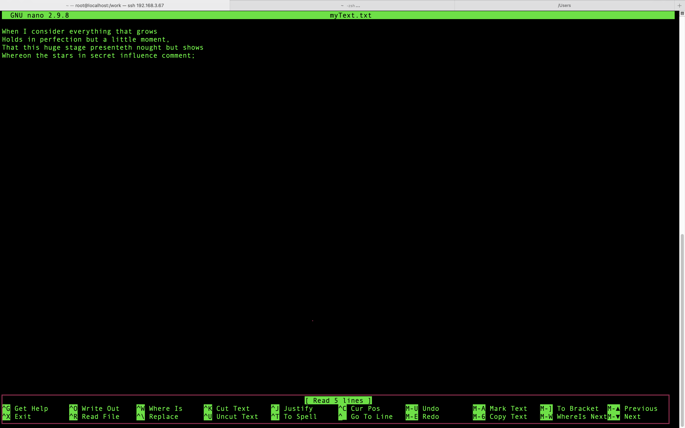

# エディター

### nanoについて

- `nano ファイルパス`
  - コマンド存在しない場合：`dnf -y install nano`.

  - `nano`のイメージ

- メタキーの説明
  - Windows：`^キーはCtrlとキー同時押下、M-キーはAltとキー同時押下`
  - MacOS  ：`^キーはCtrlとキー同時押下、M-キーはEsc押下後キー押下`

## viについて

- コマンドモード
- 編集モード

## その他エディター：Emacs ← 興味があれば勉強してください

#### 演習１：`~/work/`配下に14lines.txtを作成、以下の文字を入力

That this huge stage presenteth nought but shows  
Whereon the stars in secret influence comment;