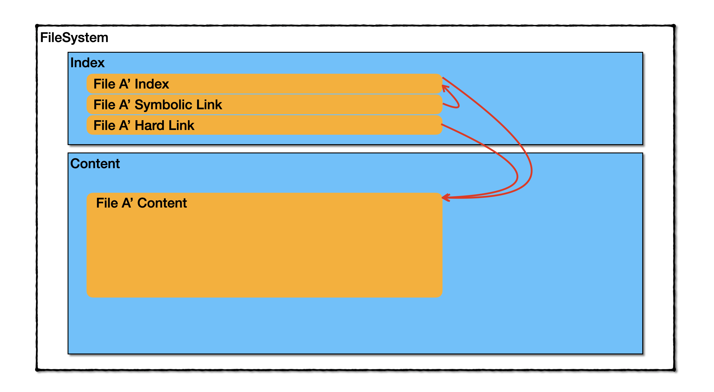

## ファイルシステム階層標準について

### 目的：標準構造の理解、パッケージインストールの各種資材の設置

#### よく利用されるパス(FHS)
- `/bin`：基本的なコマンドの配置場所、例：cdコマンド
  - 実際の位置は`/usr/bin`
- `/sbin`：システム管理に必須のコマンドの配置場所、例shudownコマンド
  - 実際の位置は`/usr/sbin`
- `/etc`：システムやアプリの設定情報、スクリプトの設定位置
  - 質問：sshの設定ファイルはどこに格納している？

- `/lib`：共用ライブラリやカーネルモジュールの配置場所
  - 実際の位置は`/usr/lib``/bin、/sbin`の各種コマンドが必要となるライブラリもここに配置している
- `/opt`：パッケージ管理の仕組みを使ってプログラムがインストールされるディレクトリである
  - 手動インストールの際にもここに配置がほとんどです
- `/var`：ログ、キャッシュ等が格納している
<!--  - `/var/cache/`
  - `/var/lock/`
  - `/var/spool/`-->
  - `/var/log`：ログファイルの位置
  - `/var/run`：アプリケーションの実行プロセスIDのデフォルト格納位置

- `/usr`：コマンドやユーティリティなどの配置位置
  - `/usr/bin`、`/usr/sbin`、`/usr/lib`
  - `/usr/local`：
  - `/usr/share`：x84やx86_64といったシステムアーキテクチャに依存しないファイルの配置場所
  - `/usr/src`：ソースコードの格納位置

### ハードリンクとソフト（シンボリック）リンクに関して

- `ln [-s][-P] リンク元パス リンク名`
  - `-P`：ハードリンク
    - デフォルトオプション
    - 同一ファイルシステムに存在が必要
  - `-s`：ソフトリンク
  - 演習：同じファイルに対してソフトリンクとハードリンクをそれぞれ作成

### その他

- `/dev`：デバイスファイル
- `/proc`：カーネル内部の情報にアクセスするための仮想的なファイルシステム
- `/root`：スーパーユーザのホームディレクトリ
- `/home`：ユーザごとのホームディレクトリ
- `/boot`：起動に必要な設定やカーネルイメージの格納場所、起動時にBIOSの制限を受けないようにするため、ルートファイルシステムとは別に、ディスクの先頭付近に配置されることがある

- `/media`：DVDなどのマウントポイントの配置場所
- `/mnt`：一時的にマウントするファイルシステムのマウントポイント
  - 外接HDDなどの一般的にマウント場所
  - マウント一覧は`/etc/fstab`を参照
  - 一時マウントを含むのマウント一覧は`/etc/mtab`を参照
- `/tmp`：一時ファイルの格納位置、全てのユーザが読書き可能のように設定している