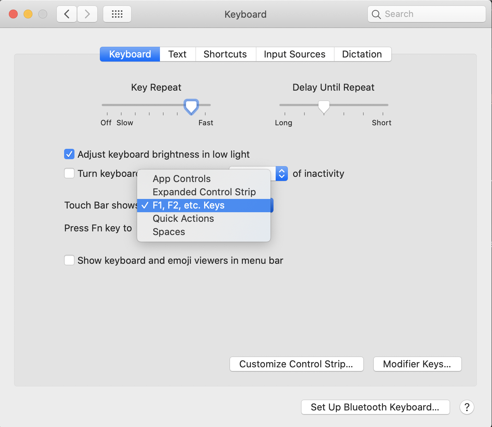
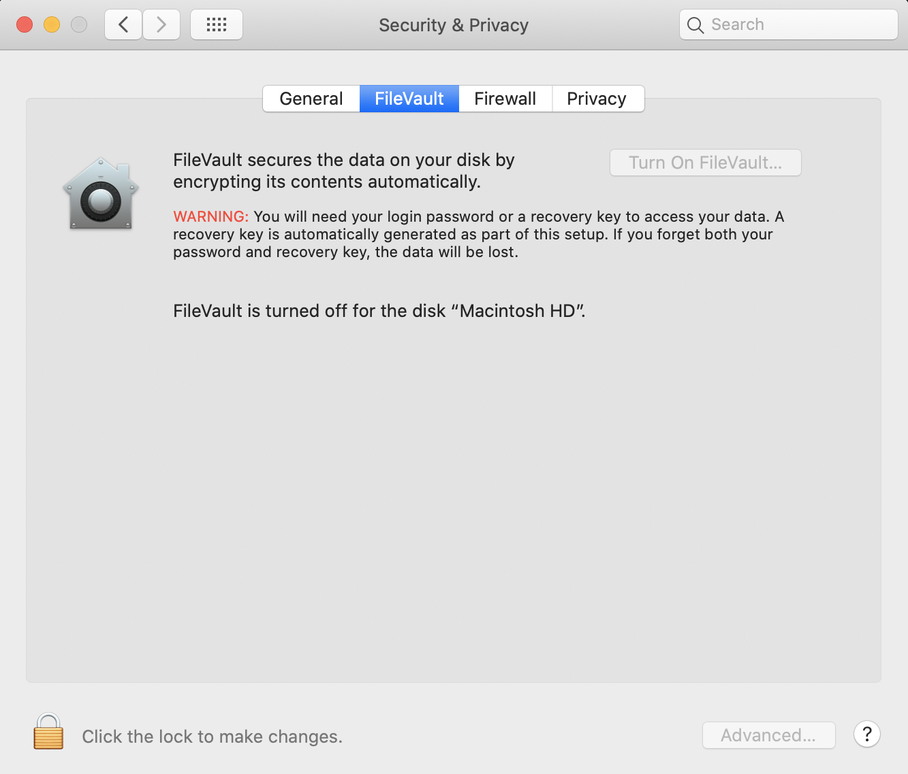
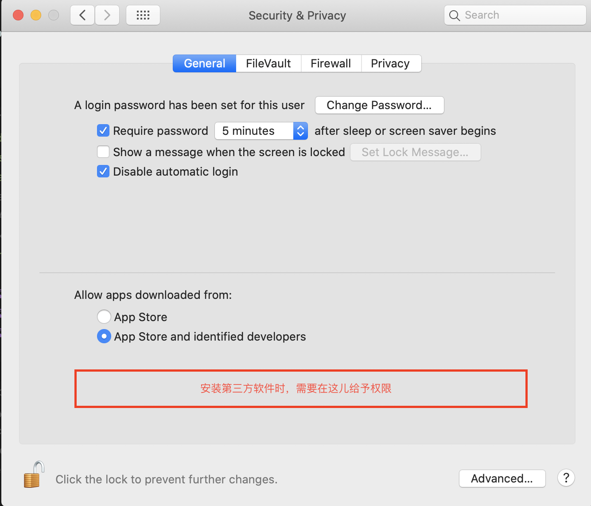

# macOS

<a href="https://xflduke.github.io/">Back to Index</a>

- [macOS](#macos)
  * [MacOS 设定备忘](#macos-----)
  * [基本设定](#----)
    + [屏幕角快捷触发 （推荐）](#------------)
    + [touchbar显示F1～F12 （看需要更改）](#touchbar--f1-f12--------)
    + [关闭全盘加密 （看需要，2016年版本曾出现过恶性bug）](#------------2016---------bug-)
    + [触控板设置](#-----)
    + [安装第三方软件（不是Appstore或者没有AppleDeveloper开发者署名的dmg）](#----------appstore----appledeveloper------dmg-)
    + [设置代理（看需求）](#---------)
  * [推荐软件](#----)
    + [推荐APP](#--app)
    + [其他APP](#--app)

## MacOS 设定备忘

环境：macOS Catalina 10.15.2 英文系统
下面详细部分的所有操作都是用Spotlight打开
快捷键【command + space 或者是 ctrl + space】，然后输入关键字回车

## 基本设定

### 屏幕角快捷触发 （推荐）

* System Preference -> Mission Control -> Hot Corners
* 

### touchbar显示F1～F12 （看需要更改）

* System Preference -> Keyboard -> Touch Bar shows
* 

### 关闭全盘加密 （看需要，2016年版本曾出现过恶性bug）

* System Preference -> Security & Privacy -> FileVault
* 

### 触控板设置

* 推荐更改【按下触发单击】为【触摸触发单击】，默认为需要用力按下
* System Preference -> Security & Privacy -> General
* 

### 安装第三方软件（不是Appstore或者没有AppleDeveloper开发者署名的dmg）

* 默认会失败，失败后需要在下面的设定里面给予权限才可以继续安装
* System Preference -> Security & Privacy -> General
* 

### 设置代理（看需求）

* System Preference -> network -> Advanced -> Proxies
* 

## 推荐软件

### 推荐APP

* homebrew ： macos上的包管理软件（linux上的类似物有yum，apt-get，dnf）
  * homepage ： https://brew.sh/index_ja
* shiftlt ： 桌面布局管理用，类似windows上的排列窗口功能（Win+方向键）
  * github ： https://github.com/fikovnik/ShiftIt
* CheatSheet ： 按住Command一段时间就自动显示当前窗口所有可用快捷键（新手强烈推荐）
  * homepage ： https://www.cheatsheetapp.com/CheatSheet/
* visual studio code ： 功能强大的编辑器，配合插件可以完成大部分轻量级开发
* XMind/MindNode/fastMinder

### 其他APP

* xcode ： macos，ios开发
* Dash ： 查看API文档用
* visualBox ： 免费虚拟机软件（Parallels Desktop性能更好，不过要交年费）

 <a href="#top">Back to top</a>

<a href="https://xflduke.github.io/">Back to Index</a>
